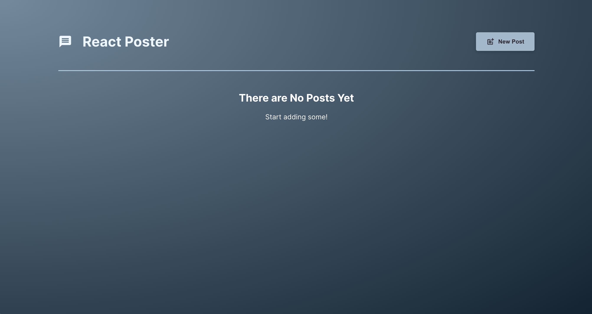
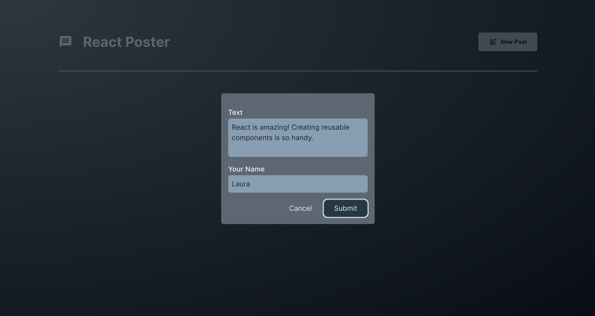
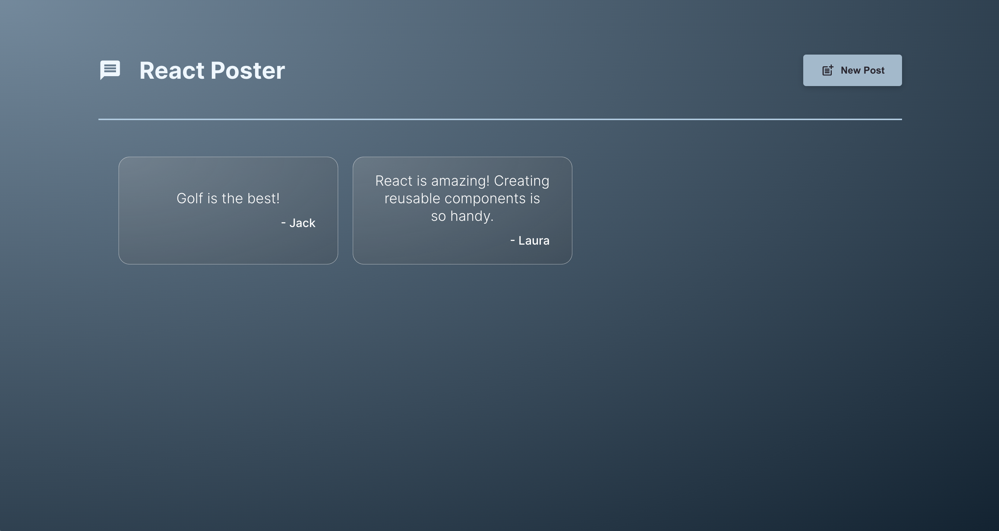

# React Poster

Welcome to React Poster, a Vite + React web app that allows users to create and view captivating posts. With its  integration of React and the Vite framework, React Poster provides an exceptional user experience, enabling effortless post creation and exploration.

## Create Post

## View All Posts

## How to Use the App

1. Clone or download the project.
2. Navigate to the directory containing the code and run `npm i` to install all the dependencies.
3. Run `npm run dev` to start the app.
4. Open your browser and navigate to the loacl path shown in your termianl to use the app.

## Features

- Explore the entire collection of posts.
- Create new posts expressing your thoughts and ideas.
- Enhance any post by clicking on it.

## Author

Laura Wu
